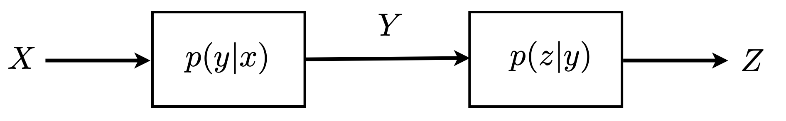
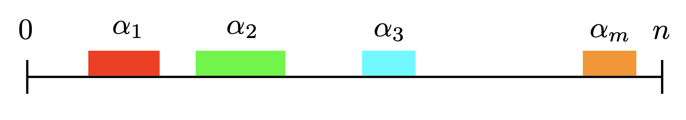
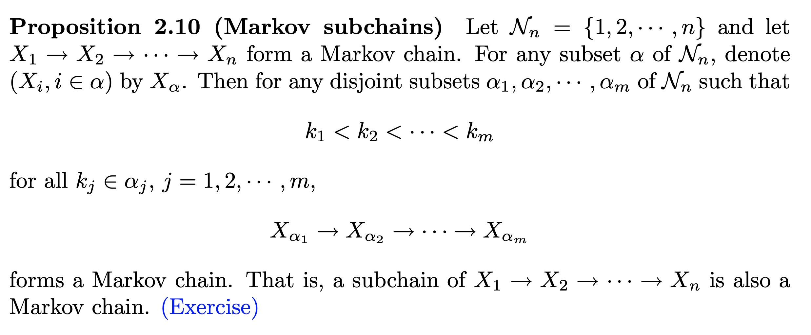

# Chapter 2: Information Measures

### 2.1. Independence and Markov Chain

April 18, 2020

#### Notations

- $X$: discrete rarndom variable taking values in $\mathcal{X}$.

- $\left\{p_{X}(x)\right\}$: probability distribution of $X$.

- $\mathcal{S}_{X}$: ==support== of $X$, i.e., $\left\{x \in \mathcal{X} | p_{X}(x)>0\right\}$

  - if $\mathcal{S}_{X} = \mathcal{X}$, we say that $p$ is **strictly positive**.

    

#### Proposition 2.4: Conditional Independence

The above is the graph showing how $X$, $Y$ and $Z$ are related, for the case: $X \perp Z | Y$, in other words, $X$ is independent of $Z \perp Y$.

---

- $p(x,y,z)=p(x)p(y|x)p(z|y)$

- $p(x,y,z)=p(x,y)p(z|y)$
- $p(x,y,z)=\frac{p(x, y) p(y, z)}{p(y)}$
- Think of passing $X$ through the channel $p(y|x)$ to obtain $Y$, and pass $Y$ through the channel $p(z|y)$ to oabtain $Z$.

---

Think it alternatively:

- if $X \perp Z | Y$: 

  - ==$p(z|x,y)=p(z|y)$==

  - ==$p(x,y,z)=p(x,y)p(z|y)$==

- if not $X \perp Z | Y$: 

  - ==$p(x,y,z)=p(x,y)p(z|x,y)$==

#### Proposition 2.5: Condition of Condional Independence

---

==$X \perp Z | Y$ if and only if $p(x,y,z)=f(x,y)g(z,y)$==, for all $x$, $y$ and $z$ such that $p(y)>0$.

---

**Note**:

- $f(\cdot)$ and $g(\cdot)$ are not necessarily probability functions. They just need to be functions that depends only on the specified variables.
- ==$0 \leq p(x,y,z) \leq p(x,y) \leq p(y)$==
- ==$p(y)=\sum_{x}p(x,y)$==
  - $p(x,y)=\sum_{z}p(x,y,z)$

**Proof of "If"**:

- Step 1:

  $\begin{aligned} p(x, y) &=\sum_{z} p(x, y, z) \\ &=\sum_{z} a(x, y) b(y, z) \\ &=a(x, y) \sum_{z} b(y, z) \end{aligned}$

- Step 2:

  $\begin{aligned} p(y, z) &=\sum_{x} p(x, y, z) \\ &=\sum_{x} a(x, y) b(y, z) \\ &=b(y, z) \sum_{x} a(x, y) \end{aligned}$

- Step 3:

  $p(y)=\sum_{z} p(y, z)=\left(\sum_{x} a(x, y)\right)\left(\sum_{z} b(y, z)\right)>0$

- Step 4:

  $\frac{p(x, y) p(y, z)}{p(y)}=\frac{\left(a(x, y) \sum_{z} b(y, z)\right)\left(b(y, z) \sum_{x} a(x, y)\right)}{\left(\sum_{x} a(x, y)\right)\left(\sum_{z} b(y, z)\right)}=f(x,y)b(y,z)=p(x,y,z)$

- Step 5

  If $p(y)=0$, given $0 \leq p(x,y,z) \leq p(x,y) \leq p(y)=0$, we will have $p(x,y,z)=0$. This is precisely the second case of proposition 2.4.

#### Definition 2.6: Markov Chain

---

For random variables $X_{1}, X_{2}, \cdots, X_{n}$, where $n \geq 3$, $X_{1} \rightarrow X_{2} \rightarrow \cdots \rightarrow X_{n}$ forms a Markov Chain if:

$p\left(x_{1}, x_{2}, \cdots, x_{n}\right)=$
$\left\{\begin{array}{ll}p\left(x_{1}, x_{2}\right) p\left(x_{3} | x_{2}\right) \cdots p\left(x_{n} | x_{n-1}\right) & \text { if } p\left(x_{2}\right), p\left(x_{3}\right), \cdots, p\left(x_{n-1}\right)>0 \\ 0 & \text { otherwise }\end{array}\right.$

---

**Remark**: $X_{1} \rightarrow X_{2} \rightarrow X_{3}$ is equivalent to $X_{1} \perp X_{2} | X_{3}$.

#### Proposition 2.7: Reversibe Markov Chain

---

$X_{1} \rightarrow X_{2} \rightarrow \cdots \rightarrow X_{n}$ forms a Markov Chain if and only if $X_{n} \rightarrow X_{n-1} \rightarrow \cdots \rightarrow X_{1}$ forms a Markov Chain.

---

#### Proposition 2.8: Clustered Markov Chain

---

$X_{1} \rightarrow X_{2} \rightarrow \cdots \rightarrow X_{n}$ forms a Markov Chain if and only if:

> $X_{1} \rightarrow X_{2} \rightarrow X_{3}$
> $\left(X_{1}, X_{2}\right) \rightarrow X_{3} \rightarrow X_{4}$
> $\vdots$
> $\left(X_{1}, X_{2}, \cdots, X_{n-2}\right) \rightarrow X_{n-1} \rightarrow X_{n}$

forms a markov chain.

---

#### Proposition 2.9: Factorized Markov Chain

---

$X_{1} \rightarrow X_{2} \rightarrow \cdots \rightarrow X_{n}$ forms a Markov Chain if and only if:

> $p(x_1, x_2, \cdots, x_n)=f_1(x_1, x_2)f_2(x_2,x_3)\cdots f_{n-1}(x_{n-1},x_n)$

for all $x_1, x_2, \cdots, x_n$ such that $p(x_1), p(x_2),\cdots,p(x_n)>0$.

---

#### Proposition 2.10: Markov Subchain

---

---

